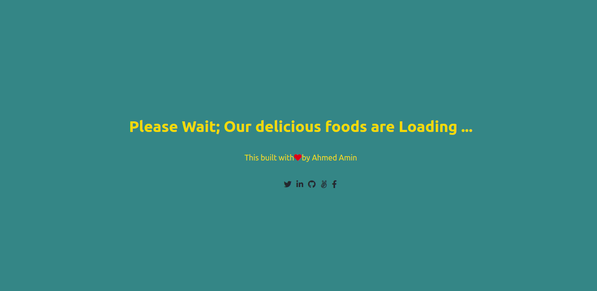
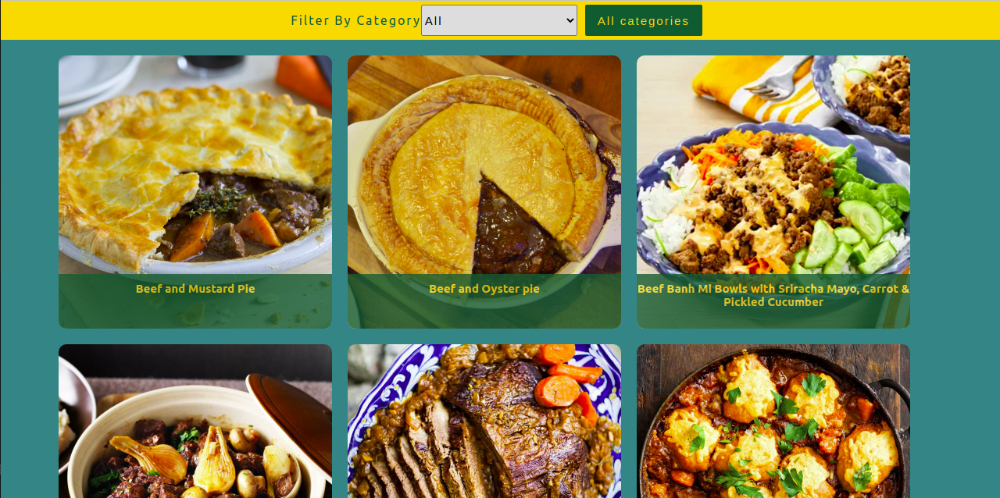
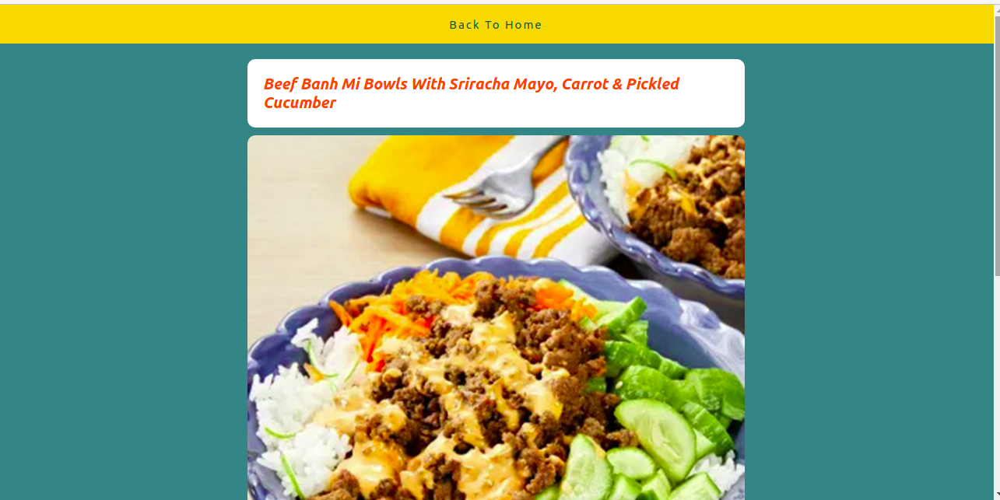

# Catalogue of recipes:
 
> This is a react and redux capstone project in Microverse. I created a simple app as a catalogue of recipes. 

# In this application:
- The user can browse the catalog of recipes and cat select food categories that he likes.
- On every single page of the food the user will find the name, the image, and the ingredients of this recipe.

# Loading screen:
 

# Rednering Foods:
 
 

# Single page:
 


Live Link:
[Live Link](https://catalogue-of-recipes-amin-dev.herokuapp.com/)


## Built With
- React.
- JS.
- Bootstrap.
- CSS.

## Setup

## Setup

1. To run this project locally, please ensure you have npm installed.
2. Open the terminal.
3. Clone this repository by running:

```bash
git clone https://github.com/AhmedAmin90/Catalogue-of-Recipes
```

4. To install the dependencies Open your terminal at the project folder: 

```bash
npm install
```

5. Start the server :

```bash
npm start
```

6. For Run test:

```bash
npm run test
```


## Authors

**Ahmed Amin** 
- GitHub: [Profile](https://github.com/AhmedAmin90)
- LinkedIn: [Profile](https://www.linkedin.com/in/web-developer/)
- AngelList: [Profile](https://angel.co/u/ahmed-amin-22)
- Twitter: [Profile](https://twitter.com/AhmedAmin12383)
- Portfolio: [My Portfolio](https://amin-dev-me.netlify.app/)


## Contribute
Any advice and suggestion for improvement are more than welcome.
Visit [issues' section](https://github.com/AhmedAmin90/Catalogue-of-Recipes/issues)

## Show your support
Give a star if you like this project!

## License
<p>This project is <a href="./LICENSE">MIT</a> licensed.</p>